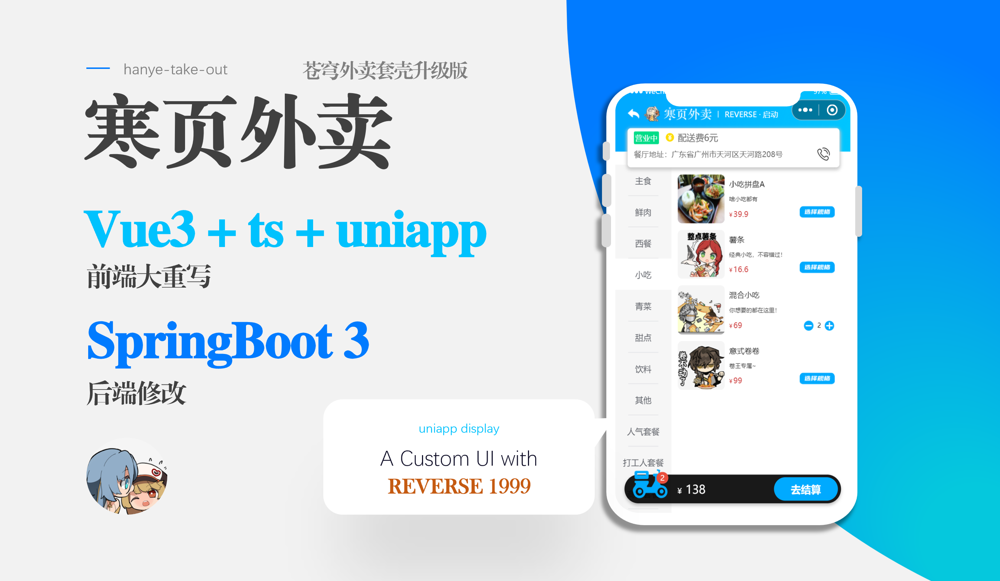

# 苍穹外卖

> 基于 Spring Boot 3 + Vue 3 + uni-app 的外卖点餐全栈示例项目，覆盖后台管理、用户点餐、订单流转、数据统计与消息通知。




## 项目亮点

- 三端联动：Spring Boot 3 后端 + Vue 3 管理端 + uni-app 用户端
- 业务闭环完整：分类、菜品、套餐、下单、支付页、历史订单、后台处理
- 管理能力齐全：工作台、订单管理、员工管理、统计报表
- 工程化基础完整：Maven 多模块、TypeScript、Pinia、Vite、Redis、WebSocket
- 适合作为课程设计、毕业设计、全栈练手项目或二次开发基础模板

## 仓库结构

```text
.
├── hanye-take-out-springboot3   # Spring Boot 3 后端
├── hanye-take-out-vue3          # Vue 3 管理端
├── hanye-take-out-uniapp        # uni-app 微信小程序端
├── hanye-take-out.sql           # 数据库初始化脚本
└── image                        # README 配图
```

## 功能一览

### 管理端

- 登录 / 注册
- 工作台数据总览
- 订单管理
- 分类管理
- 菜品管理
- 套餐管理
- 员工管理
- 营业统计与报表

### 用户端

- 微信登录
- 首页推荐与浏览
- 点餐与购物车
- 地址管理
- 提交订单
- 支付页
- 历史订单
- 订单详情
- 个人中心

### 后端

- 管理端与用户端双接口分层
- JWT 鉴权
- Redis 缓存
- WebSocket 推送
- 定时任务
- Excel 报表导出
- 微信登录 / 微信支付接入预留

## 技术栈

| 层级 | 技术 |
| --- | --- |
| 后端 | Spring Boot 3.2.5、MyBatis、PageHelper、Redis、JWT、WebSocket、POI |
| 管理端 | Vue 3、TypeScript、Vite、Element Plus、Pinia、ECharts |
| 用户端 | uni-app、Vue 3、TypeScript、Pinia |
| 数据库 | MySQL |
| 构建工具 | Maven、npm |

## 快速开始

### 环境要求

- JDK 17+
- Maven 3.9+
- Node.js 16+，建议 20.x
- MySQL 8.x
- Redis 6.x+
- 微信开发者工具

### 1. 初始化数据库

执行根目录下的 `hanye-take-out.sql`。

### 2. 启动后端

```bash
cd hanye-take-out-springboot3
mvn clean install
mvn -pl server -am spring-boot:run
```

后端默认端口：`8081`

### 3. 启动管理端

```bash
cd hanye-take-out-vue3
npm install
npm run dev
```

管理端默认端口：`5173`

### 4. 启动小程序端

```bash
cd hanye-take-out-uniapp
npm install
npm run dev:mp-weixin
```

然后将 `hanye-take-out-uniapp/dist/dev/mp-weixin` 导入微信开发者工具。

## 配置说明

后端配置主要位于：

- `hanye-take-out-springboot3/server/src/main/resources/application.yml`
- `hanye-take-out-springboot3/server/src/main/resources/application-dev.yml`

请根据自己的环境替换以下配置：

- MySQL 账号密码
- Redis 地址和密码
- 微信小程序 `appid` / `secret`
- 微信支付商户参数与证书路径
- 回调地址

用户端请求基地址位于：

```text
hanye-take-out-uniapp/src/utils/http.ts
```

管理端代理配置位于：

```text
hanye-take-out-vue3/vite.config.ts
```

## 开源前建议

- 清理 `application-dev.yml` 中的真实账号、密码、密钥、证书路径和回调地址
- 检查是否需要移除 `project.private.config.json` 等本地私有配置
- 根据实际情况补充 `LICENSE`
- 如不需要提交编译结果，可考虑移除 `hanye-take-out-uniapp/dist`

## 适用场景

- 全栈项目练手
- 外卖业务原型开发
- 课程设计 / 毕业设计
- Spring Boot 3 与 Vue 3 联调示例
- 小程序点餐系统二次开发
